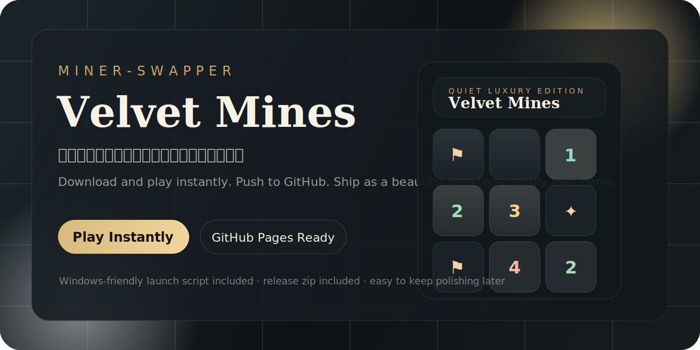
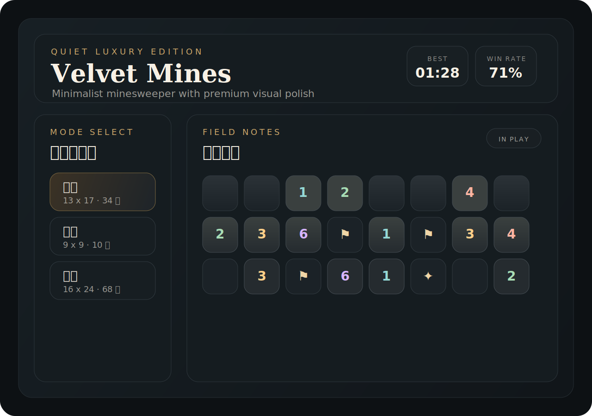

# Miner-Swapper · Velvet Mines



一个带有轻奢气质的极简扫雷游戏仓库。它保留了经典扫雷的判断乐趣，但把视觉体验、首次上手门槛和分享方式都做得更现代一点。

这个项目适合两种场景：

- 想把一个好看的小游戏直接丢到 GitHub 上展示
- 想让别人下载之后，在 Windows 电脑上几乎零学习成本地立刻开始玩

## Preview



## Why This Repo Feels Different

- 不是传统系统扫雷皮肤，而是偏极简、克制、轻奢的界面气质
- 下载仓库后可直接双击启动，不需要先安装 Node.js 或任何依赖
- 同时支持作为静态网页部署到 GitHub Pages
- 后续很适合继续升级成真正的 Windows `exe`

## Play In 10 Seconds

### 方法一：本地直接玩

1. 下载这个仓库的 ZIP 并解压。
2. 双击 `Launch-Velvet-Mines.bat`。
3. 或直接打开 `index.html`。

### 方法二：自己打一个分享包

```powershell
powershell -ExecutionPolicy Bypass -File .\scripts\package-release.ps1
```

运行后会生成：

```text
release\Velvet-Mines-windows.zip
```

别人下载这个 ZIP、解压、双击启动脚本，就可以马上开始玩。

## Controls

- 左键打开格子
- 右键插旗
- 移动端长按插旗
- 点击已揭开的数字，且周围旗子数量正确时，可快速展开邻格
- 按 `R` 可快速重开

## Features

- 三档难度，节奏从轻量到高压都覆盖
- 首击安全，开局不会被随机背刺
- 本地保存最佳成绩、胜率和连胜纪录
- 支持桌面端和移动端操作
- 提供昼夜两套氛围切换
- 自带 GitHub Pages 工作流，方便在线展示

## Project Structure

```text
.
|-- index.html                  # 游戏页面结构
|-- styles.css                  # 视觉风格与响应式布局
|-- app.js                      # 扫雷核心逻辑与交互
|-- Launch-Velvet-Mines.bat     # Windows 一键启动
|-- scripts/package-release.ps1 # 生成分享 ZIP
|-- assets/
|   |-- icon.svg
|   |-- cover.svg
|   `-- preview-board.svg
`-- .github/workflows/
    `-- deploy-pages.yml
```

## Publish To GitHub Pages

仓库已经带好 GitHub Pages 工作流。推送到 `main` 或 `master` 后，GitHub Actions 会自动部署静态页面。

第一次启用时，请到仓库：

`Settings -> Pages`

确认来源选择的是：

`GitHub Actions`

如果你的仓库名仍然是 `Miner-Swapper`，最终页面地址通常会是：

`https://lyijian86-source.github.io/Miner-Swapper/`

## Continue Polishing Later

这个仓库很适合继续往下迭代，例如：

- 封装为真正的 Windows `exe`
- 增加音效、成就系统和主题皮肤
- 做一个更完整的开始页和结束页动效
- 接入排行榜或每日挑战模式

## Local Git Workflow

后续你继续完善时，最常用的就是这三步：

```powershell
git add .
git commit -m "feat: describe your change"
git push
```

如果你想把这个项目作为公开展示作品，建议后面再补一个：

- 更正式的仓库描述
- GitHub Releases 页面说明
- `exe` 或安装包下载入口
